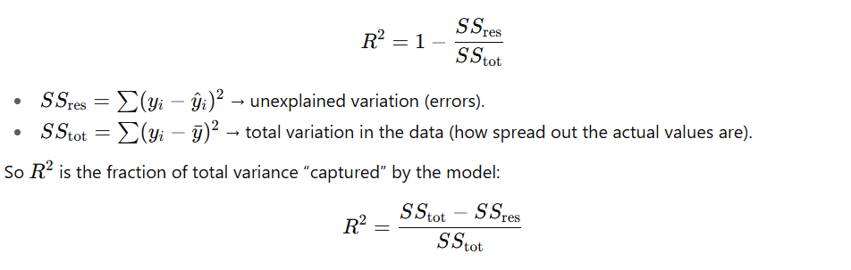

### Basics
* Feature

* Weights

* Model


### Statistics
* Sample :

* Population : 

* Estimator : A rule/formula for calculating an estimate of a population parameter based on sample of data eg. To estimate the average height of all students at a large university, estimator would be mean formula. Estimator is just a formula

* Expected Value : Weighted average of all possible outcomes

```
Example

Imagine a simple game where you roll a six-sided die, and win $2 if you roll a 1, and lose $1 if you roll any other number. Expected Value = (1/6) * $2 - (5/6) * $1 = -$ 0.5

Meaning : Expected value is not about any single game. Instead, over a large number of plays, the average outcome per game will approach -0.5 dollars. For example, if you play 100 games, you can expect to lose approximately $50 overall.


```

* Bias : Bias of an estimator is the difference between this estimator's expected value and the true value of the parameter being estimated

* Variance : How data is spread around its mean

* Variance (machine learning) : How sensitive a model is to change in data point

* Bias-Variance tradeoff


### Model Development Life Cycle

1. Define requirements
- What are we trying to optimize?
- What are latency requirements?

2. Analyze data sources
-  What kind of data do we have? (tabular, time series, supervised or unsupervised)
-  What is the refresh frquency? (streaming or batch)
-  What kind of problem? (supervised or unsupervised, regression or classification, balanced or imbalanced data)

3. Feature engineering
- Find inter-feature correlation and correlation bw feature and target variable (if supervised problem)
    - Feature-target correlation
    - Inter-feature correlation    
    - Creating Interaction Features: If two features are individually weakly correlated with the target but together have a strong relationship, you can create interaction terms. eg. using bmi instead of weight and height


- Create features using
    - difference (profit = selling price - cost price)
    - ratio (such as bmi = height/(weight)^2)
    - if-else condition 
    - log
    - square root
    - grouping (number of counts in a 3 minute window)
    - extraction (getting day of week, time of day from a timestamp)


4. Model building


5. Model deployment 

6. Model monitoring


### Feature Engineering

* Some important questions to answer in a dataset are
    * Target Variable Identification
    * Do the features contain information that helps predict the target?

* Detecting signal in target : When we say the target has "signal", we usually mean - There’s a systematic, predictable relationship between the features (X) and the target (y), not just random noise.

* To identify if features contain information one approach we can use is **shuffling the target**. If the target is truly related to the features, a model like XGBoost can find patterns and reduce error, if target is just noise, performance will look same if we shuffle the target. Shufflling breaks relationship between features and target. The approach is as follows
    * Train an XGB on the original data features and target (if there were non-linear signals, then XGB would find them. If XGB cannot find any signal in the original dataset it indicates that it isn't "low signal" or "noisy signal", instead it is just random numbers with "no signal")
    * Shuffle data 100 times and train XGB on each shuffle and calculated CV RMSE. You get a distribution of scores under the no signal assumption i.e. null hypothesis is no relationship between features and target
    * Compare the CV RMSE scores of the XGB trained with original target versus the XGB trained with the random target. If the CV score from using the original target is within z-score -2 to 2 of the CV score from using random targets, we conclude that the original data is just random numbers.

```
def root_mean_squared_error(true,pred):
    m = np.sqrt(np.mean( (true-pred)**2.))
    return m


## Code for shuffling the target
def train_xgb(
    orig,
    FEATURES,
    TARGET,
    repeats=10,
    folds=5,
    seed=42,
    **kwargs,  
):
    
    params = {
        "objective": "reg:squarederror",   
        "eval_metric": "rmse",                       
        "learning_rate": 0.3,
        "max_depth": 6,                    
        "subsample": 0.8,
        "colsample_bytree": 0.8,
        "seed": seed,      
        "alpha": 2.0,                      
        "min_child_weight": 10,
    }
    
    scores = []
    print(f"Training {repeats+1} XGB KFold CVs. ")
    for repeat in range(repeats+1):

        # FIRST ITERATION USES ORIGINAL TARGET
        # SUBSEQUENT ITERATIONS USE RANDOM TARGETS
        
        train = orig.copy()
        
        # Shuffle the target
        if repeat>0:
            t = orig[TARGET].values
            np.random.shuffle(t)
            train[TARGET] = t

        # KFOLD CV
        oof_preds = np.zeros(len(train))
        kf = KFold(n_splits=folds, shuffle=True, random_state=seed)
        
        for fold, (train_idx, val_idx) in enumerate(kf.split(train)):

            # TRAIN AND VALID DATA SPLITS
            X_train = train.iloc[train_idx][FEATURES].copy()
            y_train = train.iloc[train_idx][TARGET]
            X_valid = train.iloc[val_idx][FEATURES].copy()
            y_valid = train.iloc[val_idx][TARGET]
            dtrain = xgb.DMatrix(X_train, label=y_train, enable_categorical=True)
            dval   = xgb.DMatrix(X_valid, label=y_valid, enable_categorical=True)

            # TRAIN XGB
            model = xgb.train(
                params=params,
                dtrain=dtrain,
                num_boost_round=10_000,
                evals=[(dtrain, "train"), (dval, "valid")],
                early_stopping_rounds=100,
                verbose_eval= 0,
            )

            # INFER XGB
            oof_preds[val_idx] = model.predict(dval, iteration_range=(0, model.best_iteration + 1))

        # COMPUTE OOF CV SCORE
        m = root_mean_squared_error(train[TARGET],oof_preds)
        if repeat==0:
            print(f"When using original target CV RMSE = {m:.2f}")
        elif repeat==1:
            print(f"When using random target CV RMSE = {m:.2f}\nAdditional random trials... ",end="")
        else: 
            print(f"{repeat-1}, ",end="")
        scores.append(m)

    print(); print()
    return scores

def display_result(
    scores,
    name="",
    **kwargs, 
):
    s = np.std(scores[1:])
    m = np.mean(scores[1:])
    z = (scores[0]-m)/s
    
    print(f"z-score = {z:.2f} of Original Target CV vs. Random Target CVs")
    plt.hist(scores, bins=100, label='random targets')
    ymax = plt.ylim()[1]
    plt.plot([scores[0],scores[0]],[0,ymax/2.],color='black',linewidth=5,label='original target')
    plt.legend()


orig = train_df
TARGET = "BeatsPerMinute"
FEATURES = list( orig.columns )
FEATURES = [f for f in FEATURES if f != TARGET]
scores = train_xgb(orig, FEATURES,TARGET)
display_result(scores)

```

* We generate ~100 CV RMSE scores from random targets. Then compare the original CV RMSE against this distribution. For z-scores, the common cutoff is -2, 2 (≈ 95% confidence). t critical at 95% confidence for n =100 i.e. df = 99 ≈ ±1.984 (almost the same as z = ±1.96).

* z-score in a z-test tells you “how extreme is my observed value compared to what I’d expect if the null were true, measured in units of standard deviations?” If z-score is between -2 and 2, this indicates the z-score is not extreme enough to provide statistically significant evidence to reject the null hypothesis, suggesting the observed difference is likely due to random chance, not a true effect. In other words, the orignal cv rmse falls within the distribution of random cvs rmse(since it is less than 2 SD away), hence we believe the original data also has random targets since it falls within that distribution

* Population Distribution vs Sampling Distribution : If we take height of 150 students in class, population distribution is just plotting the histogram of 150 heights, whereas sampling distribution of mean is we take multiple samples of 15 students, for each sample, find the mean and then plot histogram of the means obtained from different samples. Hence population distribution focuses on individual data points from one large group, while the sampling distribution focuses on the variability of a statistic calculated from many smaller groups (samples). 

* Point estimate :  Single specific numerical value derived from a sample, used as the best guess for an unknown population parameter. For example, 62 is the average mark achieved by a sample of 15 students randomly collected from a class of 150 students, which is considered the mean mark of the entire class. Since it is in the single numeric form, it is a point estimator.

* Interval estimate : If the mean (or any population statistic) computed from a single sample is x, can you give an interval such that you are 95% sure the mean of the population lies in this interval

* Intuition behind hypothesis testing : Is your sample data "extreme" or "unlikely" enough to cast doubt on initial, default assumption (the null hypothesis). We evaluate how unusual our results are against the baseline expectation to decide if a real difference exists, rather than just random chance. (For example we reject the alternate hypothesis because there is a chance we get a sample where the mean is greater than 90mph although true mean is less than 90mph, so we got a sample which proves alternate hypothesis just because we were lucky rather than reflecting the actual population)

* Given the null hypothesis is true, how likely is it that random sampling would give us a mean as far away from population mean as our observed sample mean.
```
Imagine you think the average IQ of a population = 100.
You take a sample of 25 people, and get:

sample mean = 103
sample stddev = 15

Expected standard error = 𝑠 / sqrt(25) = 15/5 = 3
Difference from hypothesized mean = 103 − 100 = 3

So t= 3 / 3 = 1

Interpretation: The observed mean is only 1 standard deviation away from 100 (std dev here refers to that of sampling distribution).
That’s not unusual in a sampling distribution → so we don’t reject H₀.

But if sample mean = 110
Then t= (110−100)/ 3 = 3.33.
Now the sample mean is 3+ SEs away → very unlikely under H₀ → reject H₀.

```

* **Standard error (SE) is the standard deviation of the sampling distribution of a statistic** As number of samples increases, std dev of the sampling distribution decreases as we get more and more values closer to each other

* For both regression and classification problems, we need to analyze the target variable distribution for better model performance

* In regression, if target variable is highly skewed, we can apply transformations like
    * Log transformation
    * Box cox transformation
    * Square root transformation


```
import matplotlib.pyplot as plt
from scipy.stats import probplot, boxcox

log_transformed  = np.log1p(df[target])

boxcox_transformed = boxcox(df[target])

sqrt_transformed = np.sqrt(df[target])

## Visualizing impact of transformation
sns.histplot(log_transformed, kde=True, bins=30)
probplot(log_transformed, dist='norm', plot=plt)

```

* Reasons to transform target variable include
    * Improve the results of a machine learning model when the target variable is skewed.
    * Reduce the impact of outliers in the target variable
    * Using the mean absolute error (MAE) for an algorithm that only minimizes the mean squared error (MSE)

* XGBoost can work with skewed target variables, but performance will likely be poor if skewness is extreme, especially for regression

* To check if distribution is skewed we can
    * Plot the distribution or a quantile-quantile plot
    * Use quantitative metrics like skewness, kurtosis
    * Use normality tests like Kolmogorov-Smirnov Test

```
### Plot distribution
plt.figure(figsize=(8,5))
sns.histplot(df[target], kde=True, bins=30)
plt.title(f"Distribution of {target}")
plt.show()

### PLot Q-Q plot
# Compares sample quantiles of your data against theoretical quantiles of a normal distribution.
probplot(log_transformed, dist=norm, plot=plt)


### Using skewness
from scipy.stats import skew
skewness_value = skew(df[target])

```

* probplot generates a probability plot, which should not be confused with a Q-Q or a P-P plot
    * ppplot : Probability-Probability plot Compares the sample and theoretical probabilities (percentiles)
    * qqplot :
    * probplot : 


* ANOVA assumes data is normally distributed


* Quantiles : Divides data into equal parts. Examples of quantiles are median, quartiles and percentiles

* Percentile - Rank relationship : Percentile = ((Rank - 1)/ (Sample Size -1)) x 100. For example for 11,12,31,41,51, the rank of 41 is 4, the percentile is (4-1)/(5-1) = 0.8

* Z-score : represents the number of standard deviations a data point is from the mean in a normal distribution. (z-score of mean is zero)

* Z-scores can be used for non-normal distributions because they are a way to standardize any dataset by measuring how many standard deviations a value is from the mean. But you cannot use a standard normal distribution table to find percentile ranks with a z-score from a non-normal distribution. This is where qq plot is helpful

* For non-normal distribution, it is hard to make any direct interpretation of the z-score

* QQ plot (Quantile-Quantile plot) : Used to see if you data matches a certain distribution

* KDE (Kernel Density Estimate) plot : Provides a smoothed, continuous representation of the underlying probability density function of a variable

* Interpreting skewness metric
    * Skewness ≈ 0 -> Approximately symmetric distribution
    * Skewness > 0.5 and < 1 -> Moderately Right-skewed (long tail to the right)
    * Skewness > 1 -> Heavily right skewed
    * Skewness > - 0.5 and < 0 -> Moderately Left-skewed (long tail to the left)

* Interpreting a Q-Q plot - refer 4 video by John Barosso
    * Heavy tails → Points bend away at the ends.
    * Skewness → Points curve systematically above/below the line.


* Handling missing values

```
null_count = train_df.isnull().sum()

```

* Is feature engineering required? : Feature Engineering involves 3 things
    * Feature selection
    * Feature extraction
    * Adding features through domain expertise
Xgboost only does feature selection. The other 2 has to be done by us (only a deep learning model could replace feature extraction for you) Xgboost would have hard time on picking relations such as a*b, a/b and a+b for features a and b (refer 10)

* Tree-Based Models Learn by Splitting, Not Algebra. Hence they can learn additive relationship easily but harder time with multiplicate and division. And even harder time with non-linear transforms

* Ways to create new features include
    * Multiplication/Interaction features 
    * Non-linear/Polynomial like log, square 
    * Division/Pairwise Ratios (safe division)
    * Binning

```
df_new['Rhythm_Energy'] = df_new['RhythmScore'] * df_new['Energy']

df_new['Energy_Squared'] = df_new['Energy'] ** 2` 
df_new['Log_Duration'] = np.log1p(df_new['TrackDurationMs'])

df_new['Acoustic_Instrumental_Ratio'] = df_new['AcousticQuality'] / (df_new['InstrumentalScore'] + 0.01)

df["DurationBin"] = pd.qcut(df["TrackDurationMin"], q=10, duplicates='drop').cat.codes


```

* Interaction features are new features created by combining two or more existing features, usually to allow the model to capture relationships that aren't obvious when features are considered independently. Ways to create interaction features include
    * Manual numeric-numeric interaction (multiply/divide)
    * Automatic numeric-numeric interaction (using sklearn.preprocessing.PolynomialFeatures)
    * Categorical-categorical interactions (combine 2 categorical columns into a compound column)
    * Categorical-numerical interaction (label/one-hot encode cat column, then multiply with numerical column)

```

df = pd.DataFrame({
    'road_type': ['urban', 'highway', 'urban', 'rural'],
    'lighting': ['daylight', 'night', 'night', 'dim']
})

df['road_lighting_interaction'] = df['road_type'] + '_' + df['lighting']
# You can then Label Encode or One Hot Encode this interaction column for modeling.

```

* For categorical variable - if the data is highly imbalanced, then some feature engineering required such as 
    * Sampling techniques (oversampling, smote)
    *

* Most oversampling techniques like SMOTE are ineffective in improving Random Forest. An alternative approach is
    1. Tune model hyperparameters so the model performs well in terms of Average Precision (AP) (which is suitable for imbalanced classification problems)
    2. Set class_weight="balanced" to give more weight to minority class (aka defaulters)
    3. Cross-validation with StratifiedKFold
    4. Optimize the decision threshold by maximizing the F2 score (which weighs recall higher than precision, useful for detecting defaulters)

* Once you optimize thresholds and class weights, SMOTE often adds noise instead of signal and better avoided. Weighting the underrepresented class working better than oversampling methods. Even better, tune the sample weights.

* SMOTE is really only useful when minority-class points have dense local neighborhoods that don’t cross into majority territory, and where linear interpolation between neighbors makes sense in the feature space you’re working in. Higher dimensionality, non-linearities, gaps etc all make it result in worse performance. 

* How does stratified kfold work for imbalanced dataset?


* Feature-target correlation
    * If low : There is no strong linear relationship between that feature and the target. It does not mean the feature is useless for prediction, since non-linear relation may exist (quadratic, exponential)
    * If high : There is a linear relationship

* If no feature has high correlation with target -> **Linear regression may not explain much variance**. In simpler words, it means, Linear regresion model not able to capture relationship bw target and features well. Mathematically speaking, models R-squared value is low 

* R-squared : Measures amount of variation explained by (least squares) linear regression

* Feature-feature correlation : If two features are highly correlated, they carry almost the same information, and one of the features can be removed (removing multicollinearity) eg. height_cm and height_inch

* Outlier detection : Has different techniques such as
    * Grubbs test
    * Z-score method
    * IQR method
    * Winsorization
    * Dbscan
    * Isolation forest
    * Visualizing the data (using box plot)

* Winsorization Method / Percentile Capping is the better outlier detection technique amongst the above. In this approach, extreme values in a dataset replaced with less extreme ones

```
features = ['RhythmScore', 'AudioLoudness', 'VocalContent', 'AcousticQuality']

### Plotting boxplot
for col in features:
    plt.figure(figsize=(6,4))
    sns.boxplot(x=df[col])
    plt.title(f"Outliers in {col}")
    plt.show()

features = ['RhythmScore', 'AudioLoudness', 'VocalContent', 'AcousticQuality']

### Winsorization
for col in features:
    Q1 = df[col].quantile(0.25)
    Q3 = df[col].quantile(0.75)
    IQR = Q3 - Q1
    lower = Q1 - 1.5 * IQR
    upper = Q3 + 1.5 * IQR

    df.loc[df[col] < lower, col] = lower
    df.loc[df[col] > upper, col] = upper
    # df[col] = df[col].clip(lower=lower, upper=upper)


```


### Model Building

* Cross-validation : A resampling technique in machine learning used to evaluate the performance of a model. Using train-test split, we can evaluate the model only once, while in this approach, the model can be evaluated multiple times using same data

* K Fold Cross Validation : A technique that divides a dataset into K equal-sized subsets (called "folds") for evaluating a model's performance. In each iteration, one fold serves as the test set while the remaining K-1 folds are used for training the model. After each iteration, evaluation score is retained and model is discarded

* OOF (Out of Fold) Predictions: In K fold CV, after training, the model makes predictions on the held-out validation fold. These predictions are called "out-of-fold" predictions (happens for each iteration)

* Understanding how OOF predictions are done : Consider 5 fold CV. During 1st iteration, folds 1 to 4 are train and fold 5 is test, so we get OOF prediction for only 20% of the dataset i.e. the rows corresponding to the 5th fold. In the second iteration, we get OOF prediction for another 20% of the dataset i.e. rows corresponding to 4th fold. Only after all 5 iterations do we get OOF prediction for all the rows

```
from sklearn.model_selection import KFold
from sklearn.metrics import root_mean_squared_error
import numpy as np
import xgboost as xgb

# Initialize OOF predictions
oof_preds = np.zeros(len(train))

# Set up KFold
kf = KFold(n_splits=folds, shuffle=True, random_state=seed)

# Loop through folds

# train_idx = all rows part of train for this iteration
# val_idx = all rows part of validation for this iteration
for fold, (train_idx, val_idx) in enumerate(kf.split(train), 1):
    print(f"Training fold {fold}...")

    # Split data
    X_train, y_train = train.iloc[train_idx][FEATURES], train.iloc[train_idx][TARGET]
    X_val,   y_val   = train.iloc[val_idx][FEATURES], train.iloc[val_idx][TARGET]

    # Convert to DMatrix (optimized XGBoost format)
    dtrain = xgb.DMatrix(X_train, label=y_train, enable_categorical=True)
    dval   = xgb.DMatrix(X_val,   label=y_val,   enable_categorical=True)

    # Train model
    model = xgb.train(
        params=params,
        dtrain=dtrain,
        num_boost_round=10_000,
        evals=[(dtrain, "train"), (dval, "valid")],
        early_stopping_rounds=100,
        verbose_eval=False
    )

    # Store out-of-fold predictions
    oof_preds[val_idx] = model.predict(
        dval, iteration_range=(0, model.best_iteration + 1)
    )

# Compute overall OOF RMSE
cv_score = root_mean_squared_error(train[TARGET], oof_preds)
print(f"OOF RMSE: {cv_score:.5f}")

```

* GridSearchCrossValidation : 


* Refit on full training : This refers to the practice of retraining a machine learning model on the entire available dataset after the model's architecture and hyperparameters have been finalized through processes like cross-validation or a train-validation-test split.

* An alternative to “refit on full” is to increase the number of folds. When we use 5, 10, 20 KFold, each model is trained with 80%, 90%, 95% data respectively. (So “refit on full” is like having 100+ folds)

* In xgboost, the model’s predictive power comes from all trees up to that round. XGBoost builds models additively: Each boosting round add one new tree, and predictions are made by summing the outputs of all trees created upto that round

* For xgboost, when running experiments, it is often helpful to use a larger learning rate like LR=0.3 or LR=0.1. This lets us perform faster experiments. After we find GBDT models to include in our ensemble, we can usually boost their CV and LB a little more by decreasing the learning rate and training them longer. We can train the same models with LR=0.01 or LR=0.005

* Early stopping in XGBoost is a regularization technique designed to prevent overfitting and optimize training time. It works by monitoring the model's performance on a separate validation set during the training process and halting training when performance on this set stops improving for a specified number of rounds. For `model = xgb.train(..., num_boost_round=10_000, early_stopping_rounds=100)` if the best iteration was 1234 and no improvement happened for 100 rounds, XGBoost will actually stop at round 1334 — not at 1234. To overcome this we use iteration_range. `iteration_range=(0, model.best_iteration + 1)` which means: “Make predictions using all trees from the beginning up to and including the best iteration found during training.”

* Why early stopping is considered data leakage : Early stopping looks at the validation loss to decide how long to train (i.e., optimal number of boosting rounds). But in cross-validation, the validation set is supposed to represent unseen data. If we use it to tune training hyperparameters (like num_boost_round), then the validation set is no longer “purely unseen” → it influenced the training process. This is why it is called a data leak (mild one unless you begin using 100 or 1000 folds, then leak becomes more influencial)

* Using early stopping + refit with full : Lets say we train 7 KFold above with early stopping, and optimal number of iterations for each KFold are 2700, 2232, 2652, 2000, 2327, 2288, 1842 respectively. The average is 2292. Assuming early_stopping_rounds=200, average is actually 2092. When training with 100% train data (i.e. refit on full), we need to use K/(K-1) more iterations. So we use 7/6 * 2092 = 2440. We will now train with 100% train data using fixed 2440 iterations.


* R² is not only for linear models — you can compute it for any regression model.

* R2 value tell about amount of variability in target explained by model

* We can use mean of target variable in training data as prediction and compare your model to mean baseline. This is where R2 comes, R² measures how well your model explains the variation in the target variable compared to a simple baseline (just predicting the mean). This can easily be understood from the formula 


* A low R2 value does not necessarily imply a good model. For example in the Predicting the Beats-per-Minute of Songs challenge, target values had a normal distribution with a mean ~120.Predictions have the same general distribution, just a lot narrower. The residuals may not be large because the range of target values is small to begin with, but that doesn't mean that anyone has a good model even if R2 is low. Thus a good R2 in low variance target does not mean much

* Scenarios where a high R2 does not mean much
    * Low variance targets
    * Overfitting (R2 does not tell if model fits well out of sample)
    

```
# Low variance target example
y_true = [1000, 1010, 990, 1005, 995]
y_pred = [1000, 1000, 1000, 1000, 1000]
R² = 1 - 250/2500 = 0.90. High R2 but the model is useless

```

* R2 cannot check if there is enough signal in the target

* Suppose we generate synthetic data using a known function f(x) plus random noise. We then train a regression model that is exactly f(x), and get an R² ≈ 0.92. Then no trained model can get an R2 better than 0.92. This is because we injected Gaussian noise, so out of total variance in base signal, 8% of the variance is due to noise, which no model can explain (unless model overfits on noise). If we substitute formula it is R2 = 1 - (Noise variance/Total variance)

* In stacking (stacked ensembling), instead of training the second-level model (the meta-model) on the original input features (e.g., age, salary, pixels…), we train it on the predictions of the first-level models (the base learners). These predictions of first-level models become new features for the second-level model, hence the name meta-features. Meta-features = features generated by models, not by the original data. 

* Approach to do stacking:
    1. Train a model (say xgboost) on folds of train data and predict on the out-of-fold to get model's unbiased prediction on training data (the shape of this prediction will be (train_num_rows, 1))
    2. Repeat step 1 using other models (say catboost, random forest, lgbm). For each model you will get a prediction on training data of shape (train_num_rows, 1)
    3. Concatenate all of these predictions, you will get a matrix of shape (train_num_rows, 4) (assuming we have trained using 4 different models). These prediction of model will serve as features for the meta-model
    4. Train a lasso model with the above predictions/metafeatures matrix as input and the y_train of training data as output. This meta-model will decide how much weightage to be given to each of the base models


* An alternate stacking approach is when we train model using cross validation approach, we store each of the models. So if we have 5 folds, we will have 5 xgboost models (each xgboost model trained on 4 of the 5 folds), 5 catboost models, 5 lgbm, etc. We then use each of these models to predict on entire training data and then take average of that for each model type. For example we will have 5 xgboost predictions of shape (train_num_rows, 5), which we then average to get a prediction of shape (train_num_rows, 1). Similarly for catboost, lgbm etc. We then concatenate the prediction of different model types to get the final meta-features matrix, and train a meta model like lasso on that. The below code does the same (from reference 9)

```
def train_lightgbm(X_train, y_train, X_val, y_val):
    """Train a LightGBM model"""
    params = {
        'objective': 'regression',
        'metric': 'rmse',
        'boosting_type': 'gbdt',
        'learning_rate': 0.05,
        'num_leaves': 31,
        'max_depth': 6,
        'subsample': 0.8,
        'colsample_bytree': 0.8,
        'random_state': RANDOM_SEED,
        'verbose': -1
    }
    
    train_data = lgb.Dataset(X_train, label=y_train)
    val_data = lgb.Dataset(X_val, label=y_val, reference=train_data)
    
    callbacks = [lgb.early_stopping(stopping_rounds=100, verbose=False)]
    
    model = lgb.train(
        params,
        train_data,
        valid_sets=[val_data],
        num_boost_round=1000,
        callbacks=callbacks
    )
    
    return model


def train_xgboost(X_train, y_train, X_val, y_val):
    """Train an XGBoost model"""
    params = {
        'objective': 'reg:squarederror',
        'eval_metric': 'rmse',
        'learning_rate': 0.05,
        'max_depth': 6,
        'subsample': 0.8,
        'colsample_bytree': 0.8,
        'n_estimators': 1000,
        'random_state': RANDOM_SEED,
        'verbosity': 0
    }
    
    model = xgb.XGBRegressor(**params)
    model.fit(
        X_train, y_train,
        eval_set=[(X_val, y_val)],
        early_stopping_rounds=100,
        verbose=False
    )
    
    return model

def train_catboost(X_train, y_train, X_val, y_val):
    """Train a CatBoost model"""
    params = {
        'loss_function': 'RMSE',
        'learning_rate': 0.05,
        'depth': 6,
        'iterations': 1000,
        'random_seed': RANDOM_SEED,
        'l2_leaf_reg': 3,
        'bootstrap_type': 'Bayesian',
        'verbose': False
    }
    
    model = cb.CatBoost(params)
    model.fit(
        X_train, y_train,
        eval_set=(X_val, y_val),
        early_stopping_rounds=100,
        verbose=False
    )
    
    return model

# Train and evaluate models across folds
for fold_idx, (train_idx, val_idx) in enumerate(folds):
    print(f"\nTraining fold {fold_idx + 1}/{n_folds}")
    
    # Split data for this fold
    X_fold_train, X_fold_val = X_train.iloc[train_idx], X_train.iloc[val_idx]
    y_fold_train, y_fold_val = y_train.iloc[train_idx], y_train.iloc[val_idx]
    
    # Train models
    print("Training LightGBM...")
    lgb_model = train_lightgbm(X_fold_train, y_fold_train, X_fold_val, y_fold_val)
    
    print("Training XGBoost...")
    xgb_model = train_xgboost(X_fold_train, y_fold_train, X_fold_val, y_fold_val)
    
    print("Training CatBoost...")
    cb_model = train_catboost(X_fold_train, y_fold_train, X_fold_val, y_fold_val)
    
    # Random Forest as an additional diverse model
    print("Training Random Forest...")
    rf_model = RandomForestRegressor(n_estimators=200, max_depth=10, random_state=RANDOM_SEED, n_jobs=-1)
    rf_model.fit(X_fold_train, y_fold_train)
    
    # Make predictions on validation fold
    lgb_preds = lgb_model.predict(X_fold_val)
    xgb_preds = xgb_model.predict(X_fold_val)
    cb_preds = cb_model.predict(X_fold_val)
    rf_preds = rf_model.predict(X_fold_val)
    
    # Create a weighted average of predictions
    # We give higher weights to models that generally perform better
    blend_preds = 0.35 * lgb_preds + 0.35 * xgb_preds + 0.2 * cb_preds + 0.1 * rf_preds
    
    # Store out-of-fold predictions
    oof_predictions[val_idx] = blend_preds
    
    # Make predictions on test set
    lgb_test_preds = lgb_model.predict(X_test)
    xgb_test_preds = xgb_model.predict(X_test)
    cb_test_preds = cb_model.predict(X_test)
    rf_test_preds = rf_model.predict(X_test)
    
    # Average test predictions from this fold
    fold_test_preds = 0.35 * lgb_test_preds + 0.35 * xgb_test_preds + 0.2 * cb_test_preds + 0.1 * rf_test_preds
    test_predictions += fold_test_preds / n_folds
    
    # Calculate and display fold metrics
    lgb_rmse = rmse(y_fold_val, lgb_preds)
    xgb_rmse = rmse(y_fold_val, xgb_preds)
    cb_rmse = rmse(y_fold_val, cb_preds)
    rf_rmse = rmse(y_fold_val, rf_preds)
    blend_rmse = rmse(y_fold_val, blend_preds)
    
    print(f"Fold {fold_idx + 1} Results:")
    print(f"LightGBM RMSE: {lgb_rmse:.5f}")
    print(f"XGBoost RMSE: {xgb_rmse:.5f}")
    print(f"CatBoost RMSE: {cb_rmse:.5f}")
    print(f"Random Forest RMSE: {rf_rmse:.5f}")
    print(f"Blended RMSE: {blend_rmse:.5f}")
    
    # Store models for this fold
    models.append({
        'fold': fold_idx,
        'lgb_model': lgb_model,
        'xgb_model': xgb_model,
        'cb_model': cb_model,
        'rf_model': rf_model
    })

# Calculate overall cross-validation score
cv_score = rmse(y_train, oof_predictions)
print(f"\nOverall CV RMSE: {cv_score:.5f}")


# Filter models if any failed to train
valid_models = []
for model in models:
    if all(m is not None for m in [model['lgb_model'], model['xgb_model'], model['cb_model'], model['rf_model']]):
        valid_models.append(model)

if len(valid_models) > 0:
    # Create meta-features for stacking
    X_meta_train = np.column_stack([
        np.array([model['lgb_model'].predict(X_train) for model in valid_models]).mean(axis=0),
        np.array([model['xgb_model'].predict(X_train) for model in valid_models]).mean(axis=0),
        np.array([model['cb_model'].predict(X_train) for model in valid_models]).mean(axis=0),
        np.array([model['rf_model'].predict(X_train) for model in valid_models]).mean(axis=0)
    ])

    # Create meta-features for test set
    X_meta_test = np.column_stack([
        np.array([model['lgb_model'].predict(X_test) for model in valid_models]).mean(axis=0),
        np.array([model['xgb_model'].predict(X_test) for model in valid_models]).mean(axis=0),
        np.array([model['cb_model'].predict(X_test) for model in valid_models]).mean(axis=0),
        np.array([model['rf_model'].predict(X_test) for model in valid_models]).mean(axis=0)
    ])

    # Train a Ridge meta-model
    meta_model = Ridge(alpha=1.0)
    meta_model.fit(X_meta_train, y_train)

    # Make final predictions
    stacking_predictions = meta_model.predict(X_meta_test)

    # Analyze the performance of the stacking model
    stacking_oof_preds = meta_model.predict(X_meta_train)
    stacking_cv_score = rmse(y_train, stacking_oof_preds)
    print(f"Stacking Ensemble CV RMSE: {stacking_cv_score:.5f}")

    # Compare with the simple average approach
    print(f"Simple Average Ensemble CV RMSE: {cv_score:.5f}")

    # Select the better performing approach for final predictions
    if stacking_cv_score < cv_score:
        print("Using stacking ensemble for final predictions")
        final_predictions = stacking_predictions
    else:
        print("Using simple average ensemble for final predictions")
        final_predictions = test_predictions
else:
    print("Not enough valid models for stacking. Using simple average ensemble.")
    final_predictions = test_predictions


```

* One advatage of k-fold cross validation over splitting data into train and eval is in train-eval split, we only predict on the eval set, but in k-fold, we get predict for the entire training data. For example if we do a 80-20 split, we train on 80% of data and predict on the 20% eval dataset. Instead if we do a 5-fold cross validation, we have 5 iterations, and in each iteration, we predict on a different 20% of the data, so we end up predicting on the entire data and can then compare that against y_train

* Applying bounds to prediction : If the prediction of model is too low or too high, we replace it with some fixed value
```
min_bpm = max(60, y_train.min())  # Most songs have at least 60 BPM
max_bpm = min(200, y_train.max())  # Most songs have at most 200 BPM
bounded_predictions = np.clip(final_predictions, min_bpm, max_bpm)

```

* Some ways to compare prediction values with actual values are
    * Plot distribution of y_pred vs y_test
    * Scatter plot between y_pred and y_test
    * Residual plot of y_pred vs y_residual (y_residual = y_test-y_pred)
Below is code for all of the above (from reference 9)
```
# Distribution plot
plt.figure(figsize=(12, 6))
plt.hist(y_train, alpha=0.5, label='Actual BPM', bins=50)
plt.hist(oof_predictions, alpha=0.5, label='Predicted BPM', bins=50)

# Scatter plot
plt.scatter(y_train, oof_predictions, alpha=0.3, s=10)

# Residual plot
residuals = y_train - oof_predictions
plt.figure(figsize=(12, 6))
plt.scatter(oof_predictions, residuals, alpha=0.3, s=10)

```

* Why automated machine learning is not easy : Lets say you ask a non-DS to go pull customer data and predict likelihood of churn. 
    * What data do they need? 
    * Which SQL tables do they need to query?
    * What are the relevant features? 
    * Is it a time series problem? 
    * How about engineering features based on historical behaviour? 
    * How do you identify the target column? 
    * Now let's say they manage all of that, but the model scores 40% accuracy, now what?


### Questions
1. Variance in statistics vs variance in machine learning? 
2. If bias is for a single value, how do we apply it to multiple data points?
3. How does stratified kfold work for imbalanced dataset?
4. Why does creation of a Q–Q plot in Excel need an adjustment by 0.5? (to make the distribution symmetrical)
5. In xgboost, why cant we use only the best iteration instead of using all the iterations from 0 till the best iteration (in the case of early stopping)?
6. Can tree based methods pick relations such as a*b, a/b,a+b? Do we need to do feature engineering with models like xgboost?

### References
1. https://datasciencewithchris.com/transform-the-target-variable/
2. https://www.linkedin.com/posts/astrosica_we-made-it-92-recall-without-smote-resampling-activity-7368651053564719109-_a9f?utm_source=share&utm_medium=member_desktop&rcm=ACoAACH01PIBBVfmHJKmclThlgIPLNnlISIVIAA
3. https://www.reddit.com/r/learnmachinelearning/comments/1n0x1kp/advice_for_becoming_a_top_tier_mle/
4. https://www.youtube.com/watch?v=IgIN9-4-kSg
5. https://www.kaggle.com/code/nareshbhat/outlier-the-silent-killer
6. https://www.kaggle.com/code/cdeotte/analyze-original-dataset-from-kaggle-playgrounds#Playground-E5-S9:-Predicting-the-Beats-per-Minute-of-Songs
7. https://stats.stackexchange.com/questions/463870/eval-set-in-xgboost-and-validation-data
8. https://www.reddit.com/r/datascience/comments/1054dl3/why_hasnt_automl_been_more_widely_adopted_by/
9. https://www.kaggle.com/code/adilshamim8/predicting-the-beats-per-minute-of-songs-101
10. https://datascience.stackexchange.com/questions/17710/is-feature-engineering-still-useful-when-using-xgboost