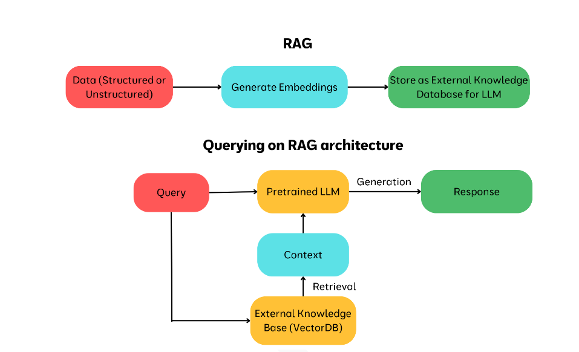

## LLM Context
Sometimes an LLM does cannot answer a question regarding which is does not have information about. Suppose you just ask Chatgpt to answer questions based on an article you wrote, it will not be able to answer as it does not have that information. However if you pass your article and then ask Chatgpt questions based on it, it will be able to answer. This article is called **context** . "context" refers to the information the model uses to generate its responses

## Context Window and Limitations
**Context window** is the amount of text, measured in tokens, that the model can process at once (basically its ability to remember). As the document gets bigger and bigger, LLM finds it harder to find the "remember" the entire document to answer your question, and may give wrong answers due to "forgetfulness".\
RAG solves this issue by breaking down a huge document into smaller parts called **chunks**, having a retrieval mechanism which identifies chunks relevant to the question and passed it to the LLM. LLM then generates answer using only relevant chunks as context

## RAG Basics
At its core, RAG which stands for **Retrieval Augmented Generation** is a technique that blends two powerful components:
1. Retrieval System: Think of this as a librarian that fetches the most relevant documents or pieces of information from a vast knowledge base.
2. Generative Model: This is the creative writer, crafting meaningful responses or content based on the retrieved information.

