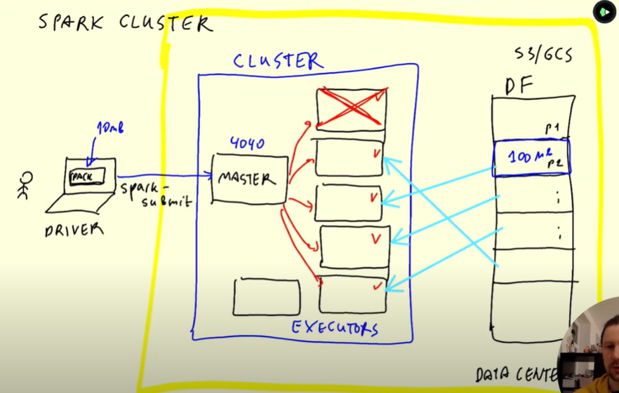

## Introduction
Spark is a framework (engine) for large scale data processing. Pyspark helps users use Spark functionalities using Python
\
\
Two things which make Spark powerful are:
* **Distributed computing** : Large computational tasks are divided into smaller, independent sub-tasks and executed in parallel (eg. Instead of filtering `region = East` in a 10GB dataset, we divide the data into 10 1 GB subdataset, send each subdataset to a separate machine, filter `region = East` parallelly on all the ten subdatasets and then combine the filtered results from each machine)
* **Lazy evaluation** :  Feature in Spark wherein a transformation is not executed immediately but only much later (more details later)

## Distributed Computing and Spark Architecture
For distributed computing, we essentially need to have multiple machines (could be real computer or a virtual machine). Also when there are multiple machines, we need one more machine to assign the tasks to different machines. Based on this logic we introduce following terms:
* **Node** : A machine
* **Worker Node** : The machine which performs the computation
* **Executor** : A Java process (process = running program) running on a worker node that performs computations. A single worker node can have multiple executors
* **Core** : A single executor has multiple "cores." These cores represent the computational units or threads available within that Executor to run tasks concurrently
* **Driver Node** : Analyzes the program given by user and then distributes the work amongst the executors (hence the central coordinating component)
* **Cluster manager** : Manages CPU and memory of worker nodes based on instruction received from driver node

* Memory vs Disk : 
    * Memory = The RAM (Random Access Memory) available on your Spark executors (i.e., the worker nodes) 
    * Disk = The local hard drive (or SSD) of those executors.

When we cache data, it is stored in memory of if too large spills to disk (more info later)
Suppose number of executor-cores is 4 and num-executors is 3, then spark can run 12 tasks in parallel. Also a cluster manager does nothing more to Apache Spark, but offering resources, and once Spark executors launch, they directly communicate with the driver to run tasks.
\
Below is a picture which shows the Spark architecture
\

\
Since we have multiple nodes, we also need to split the data into smaller chunks, so that the data can be processed in parallel. These smaller chunks are called partitions.

* **Dataset** : Data that we process, generally split into multiple smaller chunks
* **Partition** : Partition is an atomic chunk of data which is subset of the overall dataset 

For a quick video understanding of the Spark architecture refer : [DE Zoomcamp 5.4.1 - Anatomy of a Spark Cluster](https://www.youtube.com/watch?v=68CipcZt7ZA)

* Shuffling : Redistributing data amongst partitions. For operations like group by, join, repartition. 

Below is an example of shuffling when we do group by. During shuffling data moves over network as it has to move from one node to another node (and nodes are connected to each other via a network). Shuffling can happen b/w executors on same node (no network transfer) or different nodes (network transfer)

* Repartition : A transformation that reshuffles data into fixed number of partitions (given by user eg. `df_repartitioned = df.repartition(10)`). Each resulting partition will be of similar size. Reason to use repartition include:
    * Improving parallelism : Leverage all cores (eg. you have 8 cores but only 1 partition, then 7 cores will be idle) 
    * Balance data and avoiding skewed partition (eg. if one partition is much bigger than other partitions, then that core will take much longer time than others or will have OOM issue)

* Coalesce : A transformation used to reduce the number of partitions by clubbing data from multiple partitions into single partition

* Repartitions vs Coalesce : Unlike repartition, coalesce avoids full shuffle and only moves data from the extra nodes. Also repartition can increase of reduce the number of partitions whereas coalesce can only reduce the number of partitions
```
# Before coalesce (each number represents a row number)
Node 1 = 1,2
Node 2 = 3,4,5
Node 3 = 6,7,8,9
Node 4 = 10,11,12,13,14,15,16,17,18,19,20,21,22,23,24

# After repartition (into 4 partitions)
Node 1 = 1, 4, 5, 8, 20, 21
Node 2 = 2, 3, 7, 10,11, 12
Node 3 = 6, 13, 15, 17, 18, 19
Node 4 = 9, 14, 16, 22, 23, 24

# After coalesce
Node 1 = 1,2,3,4,5,6,7,8,9 
Node 4 = 10,11,12,13,14,15,16,17,18,19,20,21,22,23,24

```

* Broadcasting : Sending a copy of a dataset (typically small) to all the executors. This is an optimization used during join when one of the two datasets is small enough to fit in memory. THe smaller dataset can join with partitions of the larger dataset locally. By broadcasting, you avoid the shuffle and speed up the join.

```
Let’s say:
Large dataset: orders (100 million rows)
Small dataset: countries (200 rows)

A broadcast join:
1. Sends the countries dataset to all worker nodes.
2. Each executor joins its partition of orders with the broadcasted countries locally.

Hence no shuffling needed.
```

### Lazy Evaluation and DAG

### Miscellaneous
When a program is loaded into memory and begins to run, it becomes a process. A process involves not only the program's instructions but also its current state, including the values of its variables, the program counter (which indicates the next instruction to be executed), and the resources it utilizes, such as CPU time, memory, and I/O devices. A single program can give rise to multiple processes, each running independently. For example, opening two separate instances of a web browser (the program) creates two distinct processes. 
Think of Spark as a kitchen:

Worker Node = Kitchen building

Executor = Chef team

Core = Individual cook

The more cooks (cores), the more dishes (tasks) can be prepared simultaneously.

* Bucketing: Bucketing is a physical layout on disk, not an in-memory execution strategy.
* An out-of-memory (OOM) error when processing large partitions in Spark often indicates that the data within a partition exceeds the available memory of the executor or driver

When you use partitioning + bucketing:
Data is first partitioned by a column (e.g., country)
Then, within each partition, data is bucketed by another column (e.g., user_id)
```
df.write \
  .partitionBy("country") \
  .bucketBy(4, "user_id") \
  .sortBy("user_id") \
  .format("parquet") \
  .saveAsTable("user_data")

/table/
├── country=US/
│   ├── bucket_00000
│   ├── bucket_00001
│   └── ...
├── country=IN/
│   ├── bucket_00000
│   ├── bucket_00001
│   └── ...
```
Thus each partition has its set of buckets
Partitioning helps with query filtering (e.g., WHERE country = 'IN') — avoids scanning unnecessary folders.
Bucketing helps with joins or aggregations by ensuring data is hashed and grouped efficiently within partitions.
.collect() brings all records from all partitions across the cluster to the driver node as a Python list.

1. https://www.reddit.com/r/dataengineering/comments/15hosx6/relation_between_no_of_executors_and_cores/
2. https://www.youtube.com/watch?v=ffHboqNoW_A
3. https://stackoverflow.com/questions/31610971/spark-repartition-vs-coalesce
4. https://stackoverflow.com/questions/34722415/understand-spark-cluster-manager-master-and-driver-nodes